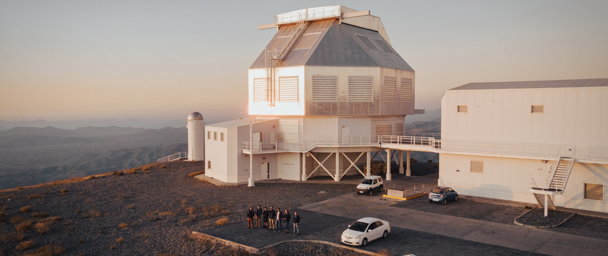

## This is Eden

I'm a fourth year PhD candidate student at the University of Arizona.  I am interested in technology and algorithm developement for ground based adaptive optics instrumentation for high contrast imaging. I am developing tools to better understand our wavefrotn sensors, the systems that interpret distortions form the atmosphere.

---

### Connect:
- 📫 [git@edens.email](git@edens.email)
- 🌱 [edenmcewen.com](https://www.edenmcewen.com/)
- ⚡ [ORCid](https://orcid.org/0000-0003-0843-5140)

<!--
**edenacadia/edenacadia** is a ✨ _special_ ✨ repository because its `README.md` (this file) appears on your GitHub profile.

Here are some ideas to get you started:

- 🔭 I’m currently working on ...
- 🌱 I’m currently learning ...
- 👯 I’m looking to collaborate on ...
- 🤔 I’m looking for help with ...
- 💬 Ask me about ...
- 📫 How to reach me: ...
- 😄 Pronouns: ...
- ⚡ Fun fact: ...
-->
